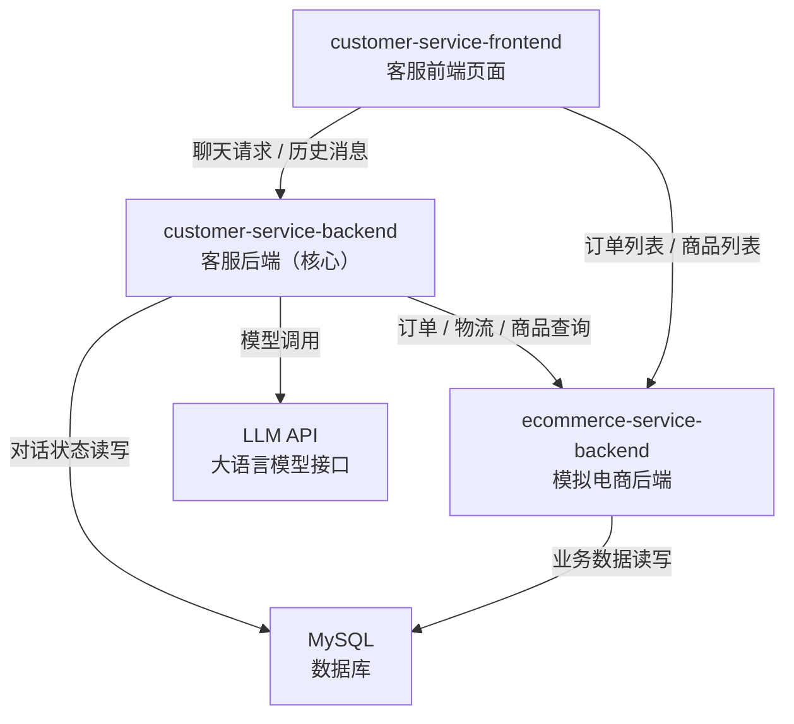
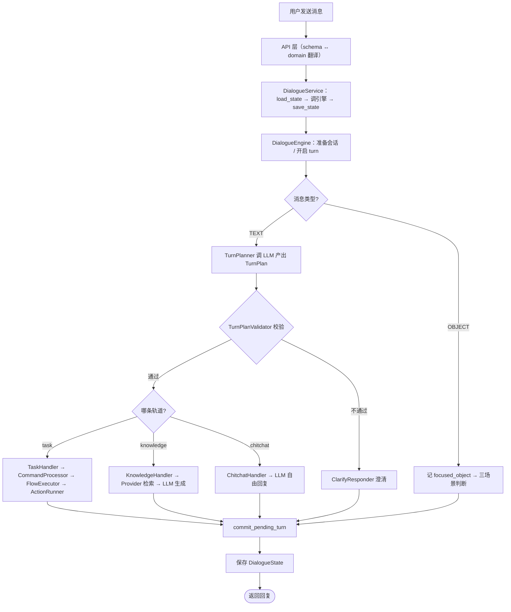

# 电商小二 · 智能客服系统

> 一个面向电商场景的智能客服系统，用「**LLM 理解用户意图 + 代码执行具体动作**」的工程范式，驯服大模型的不确定性，保证业务结果稳定可控。

---

## 项目简介

电商客服每天要处理大量重复、零散的对话（查订单、问政策、退款）。人工坐席成本高，传统关键词机器人遇复杂问法就答非所问。本项目在大模型成熟后，落地了「LLM 理解意图 + 代码执行动作」的新范式：

- **LLM 负责不确定的部分**：理解用户意图、生成自然语言回复；
- **代码负责确定的部分**：流程编排、状态管理、业务接口调用、防幻觉校验。

最终交付一个可运行、可扩展的电商智能客服系统，覆盖**任务流程（Task）**、**信息检索（Knowledge）**、**闲聊（Chitchat）**三大能力轨道。

---

## 功能特性

| 能力轨道 | 说明 | 典型场景 |
| --- | --- | --- |
| **任务流程 Task** | 步骤明确的业务任务，按 YAML 流程逐步推进 | 订单状态查询、物流查询、退款申请 |
| **信息检索 Knowledge** | 查询型问题，先检索可信信息源再生成回复 | 退款/退货/配送政策、商品/订单信息 |
| **闲聊 Chitchat** | 轻量自然对话与模糊输入兜底 | 打招呼、寒暄 |

### 固定任务流程（示例）

| 流程 | 触发 | 步骤 |
| --- | --- | --- |
| 订单状态查询 | 「帮我查下订单状态」 | 收集订单号 → 调订单接口 → 回复 |
| 物流查询 | 「我的快递到哪了」 | 收集订单号 → 调物流接口 → 回复 |
| 退款申请 | 「我要退款」 | 收集订单号 → 收集退款原因 → 提交 |

### 核心能力

- **业务流程可配置**：新增流程不改代码，只需加一份 YAML（`flow_config/*.yml`）。
- **防幻觉校验**：LLM 输出经 `TurnPlanValidator` 多轮校验，确保 flow / intent 真实存在。
- **多任务穿插**：任务支持打断、挂起、恢复、取消，`active_task` + `paused_tasks` 栈式管理。
- **对象消息（点卡片）**：与文本消息殊途同归，统一归一化为命令走同一条处理链路。
- **多知识源检索**：API / FAQ / RAG 统一抽象为 Provider，接口契约先行，可无缝替换实现。

---

## 系统架构

### 组件关系



| 组件 | 说明 |
| --- | --- |
| `customer-service-backend` | AI 客服后端，承担所有对话与 LLM 调用（核心） |
| `customer-service-frontend` | 教学用可视化控制台（左聊天区 / 右对象区） |
| `ecommerce-service-backend` | 模拟电商后端（业务中台），提供订单/物流/商品接口 |
| `mysql` | 数据库容器与脚本 |

### 分层结构

```
API 层 → Service 层 → Engine 层(顶层调度) → Planning 层(规划/意图/校验/澄清)
      → Task / Knowledge / Chitchat 三轨道层
另：Domain 层 / Repository 层 / Infrastructure 层 / Config 层
```

### 一条消息的完整链路



---

## 技术栈

| 技术 | 用途 |
| --- | --- |
| **FastAPI** | HTTP 接口 |
| **LangChain** | 封装模型调用（`init_chat_model` / `PromptTemplate` / 输出解析器） |
| **SQLAlchemy（异步）** | 数据库访问 |
| **Pydantic / pydantic-settings** | 数据结构与配置 |
| **Jinja2** | Prompt 模板渲染 |
| **PyYAML** | 流程配置加载 |
| **httpx** | 异步调用电商接口 |

---

## 目录结构

```
customer-service-backend/
├── api/                    # Web 层：路由、schema、依赖注入、应用生命周期
│   ├── routers/
│   │   ├── chat_router.py
│   │   └── dependencies.py
│   ├── schemas.py
│   └── app.py
├── domain/                 # 领域模型：messages / contexts / state
├── plan/                   # 规划层：TurnPlanner / TurnPlanValidator / 模型
├── engine/                 # DialogueEngine（顶层调度）
├── task/                   # Task 轨道
│   ├── command/            #   Command 模型 + CommandProcessor
│   ├── flow/               #   Flow 数据模型 + loader + FlowExecutor
│   └── action/             #   Action 基类 / 内置 / 自定义 / 注册
├── knowledge/              # Knowledge 轨道：intents / providers / registry / responder
├── chitchat/               # Chitchat 轨道
├── clarify/                # ClarifyResponder（澄清回复）
├── repository/             # Repository 层（DialogueState 持久化）
├── infrastructure/         # llm / http_client / database
├── models/                 # SQLAlchemy ORM 模型
├── prompts/                # Jinja2 提示词模板
├── conf/                   # 配置（pydantic-settings）
├── flow_config/            # YAML 业务流程配置（user_flows / system_flows）
└── main.py                 # 启动入口
```

---

## 快速开始

### 环境要求

- **Python** 3.12（`uv` 管理依赖）
- **Node.js** v24.15.0
- **MySQL**

### 启动步骤

**1. 还原数据库**

```sql
001_init_customer_service.sql
002_init_commerce.sql
```

**2. 启动模拟电商后端**

```bash
cd ecommerce-service-backend
cp .env.example .env      # 按需修改数据库配置
uv sync
uv run python main.py
```

**3. 启动前端**

```bash
# 配置国内镜像源（推荐）
npm config set registry https://registry.npmmirror.com

cd customer-service-frontend
npm install
npm run dev
# 访问 http://127.0.0.1:5173
```

**4. 启动客服后端**

```bash
cd customer-service-backend
cp .env.example .env      # 配置 LLM / 商城 API / 数据库 / 端口
uv sync
uv run python main.py
```

---

## 核心设计亮点

1. **规则保底 + LLM 润色**：基础话术保证下限，LLM 提升体验（澄清回复、rephrase 模式）。
2. **校验与回复分离**：`TurnPlanValidator` 只判断给原因码，话术交 `ClarifyResponder`（职责单一）。
3. **I/O 在两端、计算在中间**：Service 管加载/保存，Engine 纯计算无副作用，事务边界清晰。
4. **多态分发**：`STEP_TYPE_TO_CLASS` / `COMMAND_NAME_TO_CLASS` / `ActionRegistry` / Discriminated Union——「字符串 → 对象」同一套路。
5. **面向接口编程**：占位引擎与真引擎同签名无缝替换；Provider 抽象接口先定，替换实现不影响上层。
6. **开闭原则**：自定义 Action 自动发现注册，新增不改注册代码。
7. **安全防护**：`yaml.safe_load` 而非 `load`；`eval` 禁用 `__builtins__`；LLM 输出必须校验。
8. **优雅降级**：接口调用 `try/except` 返回 None，写降级槽位，保证流程不崩。
9. **查与说分离**：查询类 Action 写槽（`slot_updates`），回复类 Action 读槽生成回复。
10. **持久化整存 JSON**：聚合根整存一个 `state_json`（DDD 思路），简单够用、可演进。

---

## 待办 / Roadmap

| 项 | 当前状态 | 计划 |
| --- | --- | --- |
| FAQ 检索 | 占位返回 | 接入 ElasticSearch FAQ 库 |
| RAG 检索 | 占位返回 | 接入向量数据库（Milvus / Pinecone） |
| 相似商品推荐 | 占位返回 | 接入正式推荐系统 |
| `system_cannot_handle` 兜底流程 | 已实现未启用 | 确认是否启用 |
| 历史消息分割线 | 前端待实现 | 前端记录首屏快照、首次发消息插入 divider |

---

## License

教学演示项目，仅供学习交流使用。
